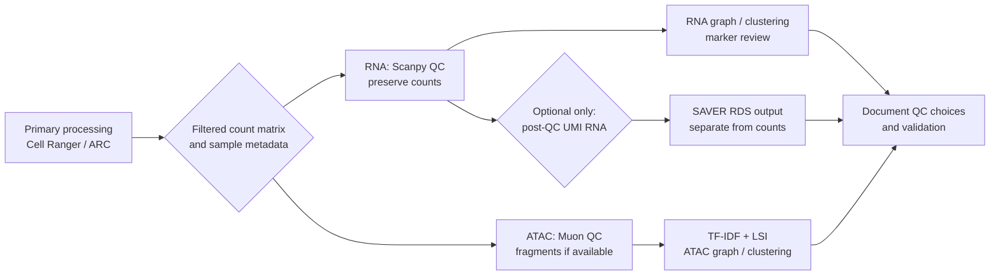

# Scanpy + Muon preprocessing after Cell Ranger: optional SAVER RNA recovery

[](https://colab.research.google.com/github/manarai/Bio559R-studio1/blob/main/tutorials/saver_scanpy/preprocess_saver_scanpy_rna_atac.ipynb)

This module teaches a **post-primary-processing** workflow for 10x single-cell count matrices:

- **RNA-only:** Scanpy quality control, normalization, feature selection, PCA, neighborhood graph, UMAP, Leiden clustering, and marker review.
- **ATAC-only:** Muon ATAC quality checks, TF–IDF, latent semantic indexing (LSI), graph construction, UMAP, and clustering.
- **10x multiome:** read RNA and ATAC into a MuData container, retain modality-specific QC, then decide deliberately whether integration is warranted.
- **Optional SAVER:** use the `r-saver` Conda package **only after RNA QC** to obtain a separate RNA expression-recovery result. It does not apply to ATAC and it never replaces the raw-count layer.

> **Read this first:** this is not a FASTQ processing workflow. Begin with the filtered HDF5 count matrix from Cell Ranger, Cell Ranger ATAC, or Cell Ranger ARC. The repository's existing [primary Cell Ranger workflow](../../README.md) remains the source of truth for raw 10x Gene Expression data.

## 0. Learning map and prerequisites



**Prerequisites.** Students should be able to navigate the command line, activate a Conda environment, open a notebook, and identify their assay type. Before any filtering, collect: species and reference build; Cell Ranger / ARC version; library chemistry; sample and batch labels; experimental groups; whether the matrix represents RNA-only, ATAC-only, or multiome; and whether a fragment file is available.

| If you have… | Start in the notebook at… | Required input | Important note |
| --- | --- | --- | --- |
| Cell Ranger Gene Expression output | RNA route | `filtered_feature_bc_matrix.h5` | Preserve unnormalized UMI counts in `rna.layers["counts"]`. |
| Cell Ranger ATAC output | ATAC route | `filtered_peak_bc_matrix.h5`; fragments recommended | Fragment-based QC requires `atac_fragments.tsv.gz` and compatible genome coordinates. |
| Cell Ranger ARC multiome output | multiome route | `filtered_feature_bc_matrix.h5`; fragments recommended | RNA and ATAC QC are assessed separately before any integration decision. |

## 1. Install the environment

The environment includes Scanpy, Muon, Jupyter, and the Conda-forge package **`r-saver=1.1.2`**. SAVER is distributed as an R package; including it in the same environment avoids a separate system-wide R installation.

```bash
# From the repository root. Prefer mamba if it is available.
mamba env create -f tutorials/saver_scanpy/environment.yml
# Or: conda env create -f tutorials/saver_scanpy/environment.yml

conda activate saver-scanpy
python - <<'PY'
import scanpy as sc, muon as mu
print('scanpy:', sc.__version__)
print('muon:', mu.__version__)
PY
Rscript -e 'library(SAVER); print(packageVersion("SAVER"))'

python -m ipykernel install --user --name saver-scanpy --display-name 'Python (saver-scanpy)'
jupyter lab tutorials/saver_scanpy/preprocess_saver_scanpy_rna_atac.ipynb
```

A Conda environment is isolated from `base`. For a shared HPC system, create it in an approved user/project location and follow local module, quota, and scheduler policies. The optional SAVER stage can require substantial time and memory; prototype it first on a small post-QC subset.

## 2. Upload / stage data safely

Use a new working directory outside of the repository for generated results. **Do not** put matrices, fragments, patient data, or derived results into Git unless they are explicitly approved for sharing.

```bash
# Example: project-local analysis area, not a change to the repository.
export SC_PROJECT=/path/to/approved/single_cell_project
mkdir -p "$SC_PROJECT"/{data/rna,data/atac,data/multiome,results,provenance}

# Make copies or symbolic links to filtered Cell Ranger outputs; keep originals read-only.
ln -s /path/to/cellranger/outs/filtered_feature_bc_matrix.h5 \
  "$SC_PROJECT/data/rna/filtered_feature_bc_matrix.h5"
```

The notebook uses explicit `RNA_H5`, `ATAC_H5`, `MULTIOME_H5`, and fragment-path variables. Edit only the paths for the selected assay. For an ATAC or multiome run, stage `atac_fragments.tsv.gz` beside the matching HDF5 matrix when available. Small, approved teaching inputs can be uploaded in Colab; full or sensitive datasets should remain on an approved local/HPC storage system.

## 3. Recommended analysis order

### RNA: raw counts → QC → analysis layers

1. Load the filtered RNA matrix and make feature names unique.
2. Save the unmodified count matrix in `rna.layers["counts"]`.
3. Calculate QC metrics; examine cell library size, detected genes, mitochondrial fraction, sample/batch, and potential doublets before filtering.
4. Use **dataset-specific** filter thresholds that are plotted and justified; do not copy an arbitrary threshold into every experiment.
5. Normalize and log-transform only the working matrix; compute highly variable genes, scale, PCA, neighbor graph, UMAP, Leiden clusters, and marker evidence.
6. Save a new `.h5ad` result and a log of threshold decisions. Treat initial clustering and marker ranks as exploratory.

### Optional SAVER: post-QC RNA UMI counts only

SAVER accepts a count matrix with **genes in rows and cells in columns** and was developed for UMI count data. It performs expression recovery by borrowing information across genes and cells. The notebook exports a sparse Matrix Market version of `rna.layers["counts"]`; `run_saver.R` makes an RDS object containing `estimate`, `se`, and run metadata.

```bash
# After running the notebook's SAVER-export cell:
conda activate saver-scanpy
Rscript tutorials/saver_scanpy/run_saver.R \
  results/saver_input/rna_counts_genes_by_cells.mtx \
  results/saver_input/genes.tsv \
  results/saver_input/barcodes.tsv \
  results/saver_output/saver_result.rds \
  4
```

**Guardrails:** run SAVER after conservative RNA QC; use original unnormalized RNA UMI counts; retain the count layer unchanged; and record its version, parameters, cores, run time, and output path. SAVER estimates should not silently replace counts for differential expression or downstream inference. Examine whether any conclusion is robust to use of the observed counts versus SAVER-derived values.

### ATAC: QC → TF–IDF → LSI

1. Load peaks as the ATAC modality with Muon; retain ATAC counts separately.
2. Inspect total fragments/counts and detected peaks; apply cohort-appropriate cell and peak filters.
3. When fragments and compatible annotation are available, inspect nucleosome signal and TSS enrichment. Their availability depends on assay output and genome annotations.
4. Apply TF–IDF and LSI. The first LSI component often tracks depth; inspect it before excluding it from the neighbor graph.
5. Compute neighbors, UMAP, Leiden clusters, and peak-based diagnostics. Do not apply RNA normalization or SAVER to peaks.

## 4. AI-assisted learning with Codex

Follow the bounded prompts and safe workflow in [CODEX_START_HERE.md](CODEX_START_HERE.md). The notebook inserts **AI checkpoints** that ask for interpretation, not blind automation. Codex should explain QC distributions, create reversible code for review, and flag expensive or unsafe steps. It must not be given authority to modify raw data, install unreviewed packages, upload data, or claim cell identities without evidence.

## 5. Student progress record

Copy this checklist into an electronic lab notebook and complete it in order.

- [ ] I identified my assay, species/reference, chemistry, samples/batches, and data-access restrictions.
- [ ] I created and verified `saver-scanpy`; recorded package versions.
- [ ] I staged a copy/symlink of filtered matrices and protected original outputs.
- [ ] I plotted **pre-filter** RNA and/or ATAC QC distributions.
- [ ] I documented every threshold and checked that it does not remove a plausible biological population.
- [ ] I retained raw RNA counts in a named layer and recorded the output `.h5ad` / `.h5mu` path.
- [ ] I used marker evidence and metadata to interpret exploratory clusters.
- [ ] If SAVER was used, I ran it only on post-QC RNA UMI counts and saved the RDS plus the exact command.
- [ ] I kept ATAC processing separate from SAVER and recorded all fragment-based QC limitations.
- [ ] I saved a reproducible methods log, not just figures.

## 6. Sources and further reading

1. [Scanpy: Preprocessing and clustering tutorial](https://scanpy.readthedocs.io/en/stable/tutorials/basics/clustering-2017.html) — AnnData structure, QC metrics, normalization, graph analysis, and clustering.
2. [Muon RNA processing tutorial](https://muon-tutorials.readthedocs.io/en/latest/single-cell-rna-atac/pbmc10k/1-Gene-Expression-Processing.html) — RNA modality handling in MuData.
3. [Muon ATAC processing tutorial](https://muon-tutorials.readthedocs.io/en/latest/single-cell-rna-atac/pbmc10k/2-Chromatin-Accessibility-Processing.html) — ATAC QC, TF–IDF, LSI, nucleosome signal, and TSS enrichment.
4. Huang M, et al. (2018). [SAVER: gene expression recovery for single-cell RNA sequencing](https://pmc.ncbi.nlm.nih.gov/articles/PMC6030502/). *Nature Methods* 15, 539–542.
5. [SAVER tutorial and function guide](https://mohuangx.github.io/SAVER/articles/saver-tutorial.html) — input orientation, post-QC use, cores, estimates, and uncertainty.
