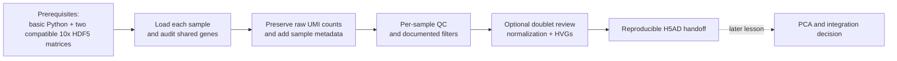

# BIO559R: two-sample scRNA-seq preprocessing with Scanpy

This folder contains a small teaching module that begins with **two compatible 10x Genomics Gene Expression HDF5 matrices** and stops after **QC, optional doublet review, normalization/log transformation, and batch-aware highly variable gene (HVG) selection**.

> **Scope boundary:** This is a preprocessing lesson. It does **not** run PCA, a neighbor graph, UMAP, clustering, cell-type annotation, differential expression, or batch correction. Combining two matrices is not batch-effect correction or biological integration.

## Lesson map



| File | Purpose |
|---|---|
| `environment.yml` | Reproducible Conda/Mamba environment with the core scverse stack: **Scanpy** and **AnnData**. |
| `scrnaseq_two_samples_preprocessing_complete.ipynb` | Fully written, heavily commented instructor/worked notebook. |
| `scrnaseq_two_samples_preprocessing_student_guided.ipynb` | No-code student workbook with one AI prompt and an empty cell for every teaching step. |
| `lesson_spec.json` / `prerequisite_map.json` | Machine-readable lesson contract and prerequisite sequence. |

## 1. Inputs and safety

### Required input format

Each input must be a 10x Gene Expression HDF5 count matrix, normally named `filtered_feature_bc_matrix.h5` in a Cell Ranger `outs/` directory. Both files should use a compatible species and reference annotation.

The notebooks use `scanpy.read_10x_h5`, so they are **not** for `.h5ad` files. Do not rename one type to resemble the other; choose the appropriate reader for the actual format.

### Before running

Record the following in your analysis notes:

- species and reference build;
- Cell Ranger version and chemistry;
- two meaningful sample IDs;
- sample-level condition and batch metadata;
- source locations and data-access permission.

Keep original HDF5 files unchanged. Work from copies or paths on approved storage. Do not commit matrices, patient data, or derived outputs to Git unless that sharing has been explicitly approved.

> **Colab/AI boundary:** Use only small, approved, non-sensitive teaching inputs in Colab. Never upload identifiable, protected, unpublished, embargoed, or access-controlled data to Colab, Google Drive, or an external AI assistant. Give AI tools only approved, non-identifying diagnostics, error messages, or summaries.

## 2. Create the Conda environment

The `scverse` name identifies the ecosystem; it is not a standalone Conda package. The environment explicitly installs the relevant scverse packages: `scanpy` and `anndata`.

The supplied Python 3.11 environment pins **Scanpy 1.11.5** and **AnnData 0.12.8**, the compatible Conda-forge builds validated for this lesson. The Colab setup cell installs the same versions.

### Clone the repository

In a terminal, clone the teaching repository and move into the newly created folder:

```bash
git clone https://github.com/manarai/Bio559R-studio1.git
cd Bio559R-studio1
```

If you already cloned the repository, update it and return to its root instead:

```bash
git pull --ff-only
cd /path/to/Bio559R-studio1
```

### Create and activate the environment

From the repository root, use **one** of the following commands to create the named environment from the lesson's YAML file:

```bash
# Preferred when available: faster environment solving
mamba env create -f tutorials/scrnaseq_preprocessing/environment.yml

# Or use Conda
conda env create -f tutorials/scrnaseq_preprocessing/environment.yml
```

After the environment has been created, activate and verify it:

```bash
conda activate bio559r-scrnaseq

python - <<'PY'
import anndata as ad
import scanpy as sc
print("Scanpy:", sc.__version__)
print("AnnData:", ad.__version__)
PY
```

Register a clearly named Jupyter kernel and launch JupyterLab:

```bash
python -m ipykernel install --user \
  --name bio559r-scrnaseq \
  --display-name "Python (bio559r-scrnaseq)"

jupyter lab tutorials/scrnaseq_preprocessing/
```

In JupyterLab, open a notebook and select **Kernel → Change Kernel → Python (bio559r-scrnaseq)**.

## 3. Google Colab workflow

The completed notebook has a Colab-only setup cell that installs the same Python analysis stack into a temporary Colab runtime. The Conda environment remains the preferred reproducible route for local/HPC work.

After these files have been committed and pushed to the `main` branch of `manarai/Bio559R-studio1`, use these launch links:

- [Completed notebook in Colab](https://colab.research.google.com/github/manarai/Bio559R-studio1/blob/main/tutorials/scrnaseq_preprocessing/scrnaseq_two_samples_preprocessing_complete.ipynb)
- [Student guided notebook in Colab](https://colab.research.google.com/github/manarai/Bio559R-studio1/blob/main/tutorials/scrnaseq_preprocessing/scrnaseq_two_samples_preprocessing_student_guided.ipynb)

Alternatively, upload either `.ipynb` file to Colab. On a fresh runtime:

1. Run the package setup cell.
2. If imports fail, restart the runtime once and choose **Runtime → Run all**.
3. Edit the configuration cell: species, meaningful sample IDs, and metadata.
4. In upload mode, choose exactly two approved `.h5` files.
5. Do not treat Colab storage as persistent. Download or copy only approved derived results when the lesson is complete.

## 4. Teaching flow

Use the two notebooks differently:

### Completed notebook

Use `scrnaseq_two_samples_preprocessing_complete.ipynb` for an instructor demonstration or a first independent run. Every code cell begins with its **purpose** and **why** the step matters. The workflow is:

1. establish privacy, scope, and the two-file data contract;
2. install/import packages and record versions;
3. label samples and add sample-level metadata;
4. load and audit each matrix separately;
5. check gene overlap, concatenate using shared genes, and preserve raw UMI counts;
6. calculate/plot QC by sample;
7. choose transparent sample-specific filtering rules;
8. optionally score doublets without deleting them automatically;
9. normalize and log-transform the working matrix;
10. mark batch-aware HVGs; and
11. save a new `.h5ad` object and JSON provenance record.

### Student guided notebook

Use `scrnaseq_two_samples_preprocessing_student_guided.ipynb` as the AI-assisted in-class exercise. It contains **no solution code**. Students generate one small cell per step, then verify it before moving forward. The workbook includes the four essential coaching jobs:

| AI coaching job | Student responsibility |
|---|---|
| Explain a QC decision | Check assumptions, failure modes, and relevance to the diagnostic. |
| Diagnose before editing | Review ranked hypotheses and make the smallest reversible change. |
| Design one bounded variation | Change one parameter, predict a diagnostic effect, and decide retain/narrow/withdraw. |
| Audit a claim | Separate observation, inference, limitation, and next test. |

For every AI interaction, students must retain a **verification record**: prompt purpose, accepted/rejected suggestion, diagnostic rerun, and claim disposition.

## 5. Expected output

The completed notebook writes two derived files under `results/`:

- `two_sample_preprocessed.h5ad` — raw UMI counts in `layers["counts"]`, per-cell QC metrics, sample metadata, normalized/log-transformed `X`, and HVG annotations;
- `two_sample_preprocessing_parameters.json` — inputs, package versions, QC/doublet choices, normalization target, and scope boundary.

The saved object is a **handoff**, not a finished biological analysis. Before any batch correction or integration, inspect PCs and sample-associated variation with a defined biological question and diagnostic plan.

## 6. Reference workflow

The notebook adapts the preprocessing emphasis of the current Scanpy tutorial while intentionally omitting its downstream analysis steps:

- [Scanpy: Preprocessing and clustering](https://scanpy.readthedocs.io/en/latest/tutorials/basics/clustering.html)
- [Scanpy legacy PBMC workflow](https://scanpy.readthedocs.io/en/latest/tutorials/basics/clustering-2017.html)
- [Scanpy installation guidance](https://scanpy.readthedocs.io/en/latest/installation.html)
- [Scanpy Scrublet API](https://scanpy.readthedocs.io/en/1.11.x/api/generated/scanpy.pp.scrublet.html)
